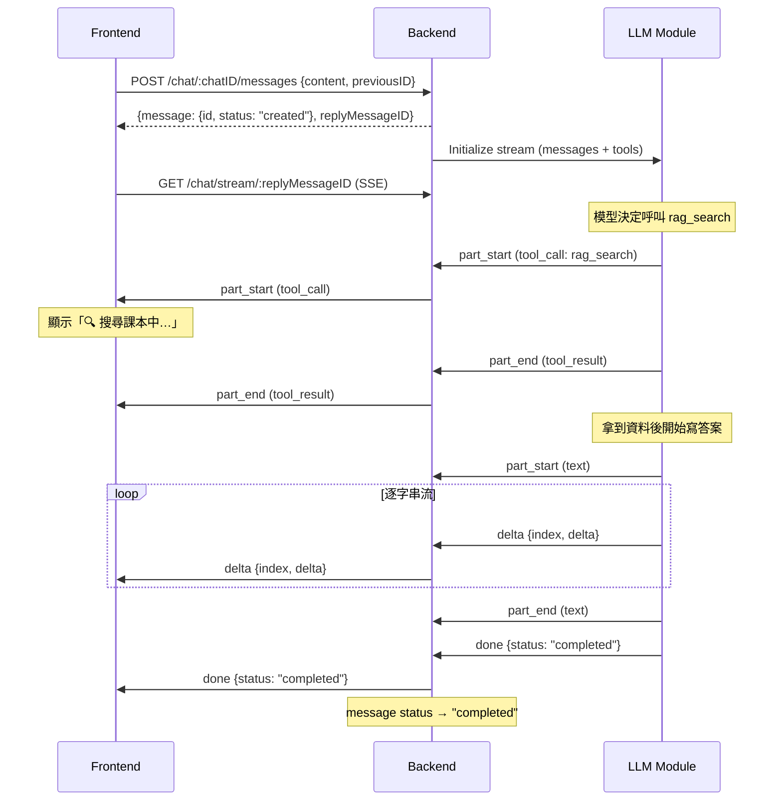
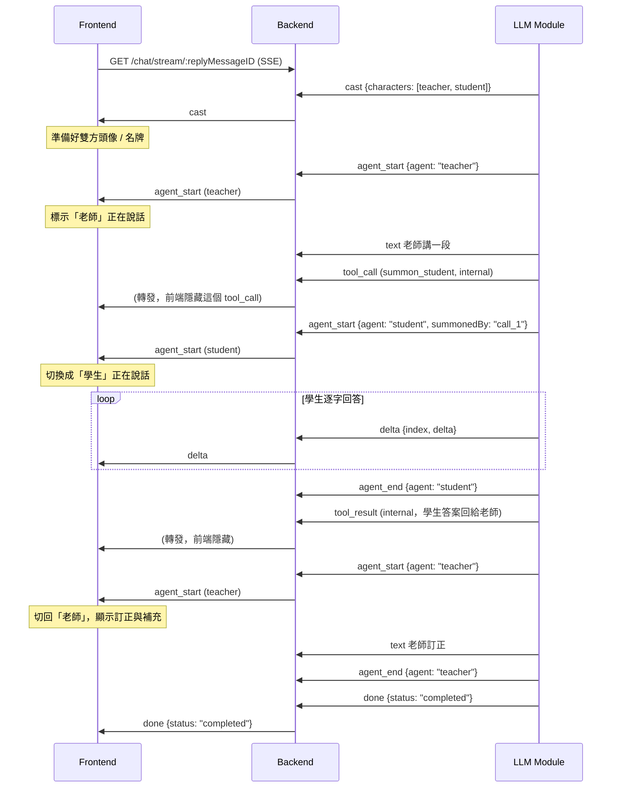
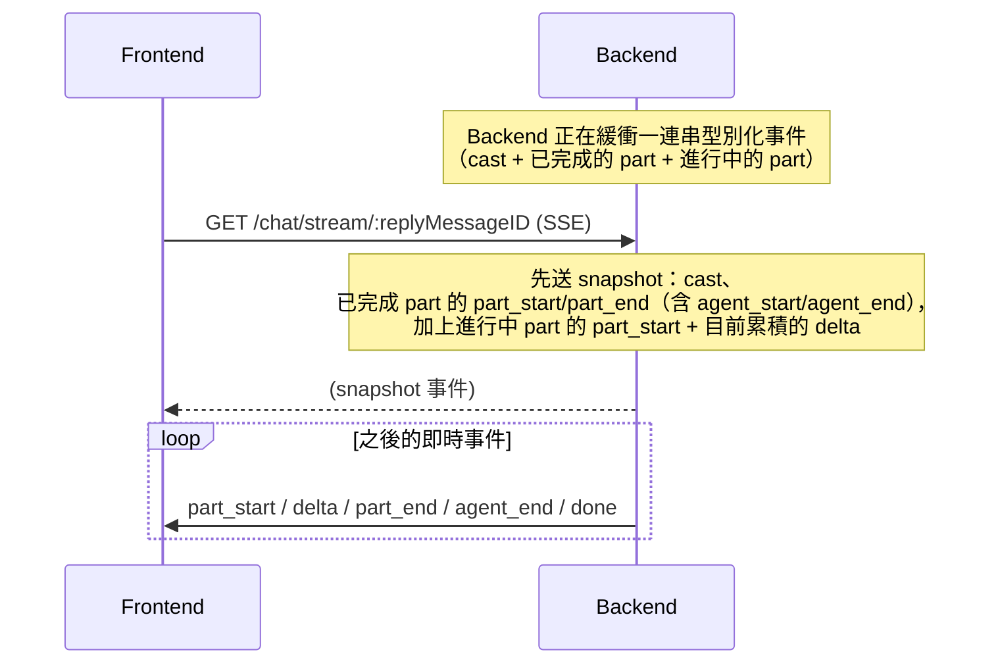

<aside>


最後更新：Sprint 6

本文是〈LLM Interaction Protocol〉的延伸，只補充 **Agentic Workflow**（工具呼叫與多角色對話）帶來的新行為。基礎的 Conversation / Message / 串流 / 斷線重連規則沿用原文，這裡不再重述。工程實作細節請見 [`agentic-protocol-design.md`](./agentic-protocol-design.md)。

</aside>

## 從「一段回答」到「一連串步驟」

在原本的協定裡，LLM 的一次回答就是一串文字 token。但一個會用工具、會找資料、甚至會有多個「角色」互相討論的 LLM，它的一次回答其實長這樣：

1. Alice 問：「幫我根據課本第三章解釋光合作用」
2. **老師（Teacher）** Agent 先想一下要怎麼教
3. 老師決定先去**搜尋課本**（呼叫工具 `rag_search`），拿到第三章的段落
4. 老師決定先**召喚一位學生（Student）** Agent 來試著回答（透過一個工具呼叫）
5. 學生講了一段自己的理解
6. 老師針對學生的回答做出**訂正與補充**，寫出最終給 Alice 看的內容

對前端來說，這裡有兩個關鍵變化：

- 一則 assistant 訊息，不再是一段字串，而是**一連串型別化的「步驟」**（想、查資料、講話…）。
- 這些步驟**可能來自不同角色**（老師、學生）。前端必須能**即時分辨現在是誰在講話**，並把畫面呈現成「兩個人在對話」。

<aside>

**本次不支援需要前端執行的工具。** 所有工具都由 LLM Module 自己執行，因此一次回答**不會中途暫停等前端**——它會在同一條串流裡從頭跑到尾。原文的暫停 / 補資料流程在這裡用不到。

</aside>

## 新的 Data Model：Message 由多個 Part 組成

原本 Message 的 `content` 是一段字串。現在 assistant 的 Message 改成一個 **`parts` 陣列**，每個 part 是一個型別化的步驟：

```jsonc
{
  "role": "assistant",
  "status": "streaming",
  "parts": [
    { "type": "text",        "id": "p0", "agent": "teacher",
      "text": "我先讓學生試著回答看看。" },
    { "type": "tool_call",   "id": "p1", "agent": "teacher", "internal": true,
      "tool_call_id": "call_1", "name": "summon_student",
      "arguments": { "task": "解釋光反應" } },
    { "type": "text",        "id": "p2", "agent": "student",
      "text": "光反應發生在類囊體膜上…" },
    { "type": "tool_result", "id": "p3", "agent": "teacher", "internal": true,
      "tool_call_id": "call_1", "status": "ok", "content": "…學生的回答…" },
    { "type": "text",        "id": "p4", "agent": "teacher",
      "text": "講得不錯，不過有一個地方要修正…" }
  ]
}
```

### Part 的型別

| type | 前端怎麼呈現 |
| --- | --- |
| `text` | 給使用者看的正式回答（會逐字串流），屬於某個角色 |
| `reasoning` | 角色的思考過程，可摺疊或隱藏（會逐字串流） |
| `tool_call` | 「某角色正在使用工具」的狀態，例如「🔍 搜尋課本中…」 |
| `tool_result` | 工具回傳的結果 |

### 每個 Part 的共通欄位（**前端最重要的三個欄位**）

- **`agent`**：**這個 part 是哪個角色產生的**（`"teacher"`、`"student"`，單一角色時是 `"assistant"`）。前端就是靠這個欄位決定「這句話是誰說的」。
- **`id`**：這則訊息內唯一的識別碼。
- **`internal`**（可選，預設 `false`）：`true` 代表這是**內部機制**、前端預設隱藏。老師「召喚學生」的 `tool_call`、以及把學生答案回傳給老師的 `tool_result` 都是 `internal: true`；而**學生自己講的那段 `text` 不是 internal**，會被當成一個真正的說話者呈現。

## Message 狀態：維持不變

因為每次回答都在同一條串流裡跑完、不會中途暫停等前端，狀態沿用原文，**沒有新增**：`created` / `streaming` / `completed` / `failed`。

## 多角色：老師 orchestrator 召喚學生

一個問題可以由多個**角色（character）**分工。其中一個角色是 **orchestrator（老師）**，它可以透過工具呼叫**召喚**另一個角色（學生）。

關鍵需求：**被召喚的角色是一個「真正的說話者」，不是被摺疊起來的工具結果。** 前端要把老師和學生畫成兩個人在對話。因此我們把「召喚」拆成兩件事：

- **機制（隱藏）**：老師呼叫 `summon_student` 的 `tool_call`、以及把學生答案交回老師的 `tool_result`。兩者都是 `internal: true`，前端預設不顯示。
- **對話（顯示）**：學生實際跑起來後，它講的 `text`（與 `reasoning`）會以 `agent: "student"` 串流出來，並用 `agent_start` / `agent_end` 框住。這些**不是** internal——它們就是畫面上「學生說的話」。

換句話說：工具呼叫只是老師「叫出」學生的手段，但學生「講的話」會以一個對等的說話者身分，直接出現在對話流裡它被產生的位置。

## 新的 SSE 事件型別

原本串流只有一種事件（`delta` + `isFinished`）。現在因為一則訊息有很多不同型別、且屬於不同角色的步驟，SSE 改成**帶 `type` 的型別化事件**：

| event `type` | data | 意思 |
| --- | --- | --- |
| `cast` | `{ characters: [{ id, displayName, role }] }` | 這次回答有哪些角色（含顯示名稱）。**開頭送一次**，讓前端先準備好頭像 / 名牌。單一角色時省略。 |
| `part_start` | `{ index, part }` | 開始一個新步驟（此時串流欄位還是空的） |
| `delta` | `{ index, delta }` | 往「第 `index` 個 part」的串流欄位追加內容 |
| `part_end` | `{ index, part }` | 這個步驟結束，附上完整內容 |
| `agent_start` | `{ agent, parent?, summonedBy? }` | 某個角色**開始說話**（被召喚時會帶 `parent` / `summonedBy`） |
| `agent_end` | `{ agent }` | 某個角色說完了 |
| `done` | `{ finishReason, status }` | 串流正常結束（`status` 一律是 `completed`） |
| `error` | `{ error, code }` | 串流失敗結束 |

<aside>

**前端最關鍵的兩個對齊機制：**

- **`index`**：`delta` 靠它對應到正確的那個 part；斷線重連後也是靠它重新對齊、去重。
- **`agent`（＋`agent_start`/`agent_end`）**：這就是「**現在是誰在講話**」的答案。前端在收到 `agent_start` 時把「目前說話者」切換過去，之後所有 part 都歸給那個角色，直到 `agent_end`。

</aside>

<aside>

**向後相容**：如果請求**沒帶 `tools` 也沒帶 `workflow`**，串流行為和舊版完全一樣（`{ delta, isFinished }`）。既有的純聊天前端不用改。

</aside>

## SSE 串流到底改了什麼？（老師召喚學生的完整範例）

原本的串流假設「一條線性的文字＝一則訊息」：

```
data: {"delta": "你好", "isFinished": false}
data: {"delta": "", "isFinished": true}
```

現在一則訊息是「一串有型別、且分屬不同角色的 part」，所以每個事件都帶 `type`，而且內容事件都用 `index` 綁到某個 part。下面是老師召喚學生的**完整事件序列**：

```
data: {"type":"cast","characters":[{"id":"teacher","displayName":"老師","role":"teacher"},{"id":"student","displayName":"學生","role":"student"}]}

data: {"type":"agent_start","agent":"teacher"}
data: {"type":"part_start","index":0,"part":{"type":"text","id":"p0","agent":"teacher"}}
data: {"type":"delta","index":0,"delta":"我先讓學生試著回答看看。"}
data: {"type":"part_end","index":0,"part":{"type":"text","id":"p0","agent":"teacher","text":"我先讓學生試著回答看看。"}}

data: {"type":"part_start","index":1,"part":{"type":"tool_call","id":"p1","agent":"teacher","internal":true,"tool_call_id":"call_1","name":"summon_student"}}
data: {"type":"delta","index":1,"delta":"{\"task\":\"解釋光反應\"}"}
data: {"type":"part_end","index":1,"part":{"type":"tool_call","id":"p1","agent":"teacher","internal":true,"tool_call_id":"call_1","name":"summon_student","arguments":{"task":"解釋光反應"}}}

data: {"type":"agent_start","agent":"student","parent":"teacher","summonedBy":"call_1"}
data: {"type":"part_start","index":2,"part":{"type":"text","id":"p2","agent":"student"}}
data: {"type":"delta","index":2,"delta":"光反應發生在類囊體膜上…"}
data: {"type":"part_end","index":2,"part":{"type":"text","id":"p2","agent":"student","text":"光反應發生在類囊體膜上…"}}
data: {"type":"agent_end","agent":"student"}

data: {"type":"part_start","index":3,"part":{"type":"tool_result","id":"p3","agent":"teacher","internal":true,"tool_call_id":"call_1"}}
data: {"type":"part_end","index":3,"part":{"type":"tool_result","id":"p3","agent":"teacher","internal":true,"tool_call_id":"call_1","status":"ok","content":"…"}}

data: {"type":"agent_start","agent":"teacher"}
data: {"type":"part_start","index":4,"part":{"type":"text","id":"p4","agent":"teacher"}}
data: {"type":"delta","index":4,"delta":"講得不錯，不過有一個地方要修正…"}
data: {"type":"part_end","index":4,"part":{"type":"text","id":"p4","agent":"teacher","text":"講得不錯，不過有一個地方要修正…"}}
data: {"type":"agent_end","agent":"teacher"}

data: {"type":"done","finishReason":"stop","status":"completed"}
```

前端看到的畫面就是：**老師說話（p0）→〔隱藏的召喚〕→ 學生說話（p2）→〔隱藏的結果〕→ 老師說話（p4）**。兩個人、身分清楚、即時呈現。

## 使用者流程

### 情境一：LLM 自己用工具（例如查課本）

工具由 LLM Module 自己執行，整個過程在**同一條串流**裡跑完，前端只要把步驟畫出來，**不需要多一次來回**。



### 情境二：老師召喚學生（多角色）

對前端來說這仍然是**一則** assistant 訊息，但裡面的 part 分屬 `teacher` 與 `student`，並用 `agent_start` / `agent_end` 框起來。前端據此畫成兩個人對話。



### 情境三：斷線重連（Agentic 版）

規則和原文一樣：**先補上你錯過的、再繼續即時串流**。差別只在於「錯過的東西」現在是一連串型別化事件（含 `cast` 與各角色的 part），而不是一段字串。



<aside>

前端靠每個事件的 `index` 對齊：snapshot 與即時串流重疊處用 `index` 去重即可。若訊息已是 `completed` / `failed`，緩衝是完整且有限的，重連會補完整份事件記錄後關閉 SSE。

</aside>

## API 行為

### `POST /chat`（送給 LLM Module 的請求）新增欄位

```jsonc
{
  "messages": [ ... ],
  "stream": true,

  // 工具（可選；全部由 LLM Module 自己執行）
  "tools": [
    { "type": "function",
      "function": { "name": "rag_search", "description": "...", "parameters": { ... } } }
  ],
  "tool_choice": "auto",         // "auto" | "none" | "required" | {name}
  "max_steps": 8,

  // 多角色（可選）
  "workflow": {
    "orchestrator": "teacher",
    "characters": [
      { "id": "teacher", "displayName": "老師", "role": "teacher",
        "prompt_name": "agents/teacher", "tools": ["rag_search", "summon_student"] },
      { "id": "student", "displayName": "學生", "role": "student",
        "prompt_name": "agents/student", "tools": ["rag_search"] }
    ],
    "max_turns": 6
  }
}
```

- **沒帶 `tools`、也沒帶 `workflow`** → 完全等同舊版純聊天（含舊版 SSE 格式）。
- `characters[].displayName` / `role` 就是前端用來顯示說話者名牌 / 頭像的依據，會在 `cast` 事件裡先送給你。
- `summon_student` 是一個 server 工具，它的執行內容就是「跑起學生這個角色」並把回答交回老師。
- 舊的 `enable_rag: true` 仍可用，等同「自動註冊 `rag_search`、`tool_choice: auto`」——差別是現在由角色自己決定何時搜尋。

### 新的 SSE 連線發生時

規則沿用原文：沒有進行中的 SSE 就回 4XX；有進行到一半的就先送一個 snapshot（過往已完成事件 + 進行中 part 目前累積內容），再持續轉發新事件。差別只在於現在傳的是型別化事件，`delta` 要靠 `index` 對齊到正確的 part。

## 給前端 / 後端工程師的重點整理

- **後端**：緩衝的是「型別化事件記錄」而不是字串；每個回答都在**一條**串流裡跑完，不需要暫停 / 補資料的流程；`cast` 要跟著一起緩衝，重連時最先補送。
- **前端**：把「接 token」升級成「渲染一連串型別化 part」；用 `index` 對齊 `delta` 與去重；用 `agent` ＋ `agent_start` / `agent_end` 判斷**現在是誰在講話**，把老師 / 學生畫成兩個說話者；`internal: true` 的 part（召喚工具與其結果）預設隱藏。
- **兩邊共通**：沒用到 agentic 功能時，一切和舊協定完全相同——可以漸進式導入。
