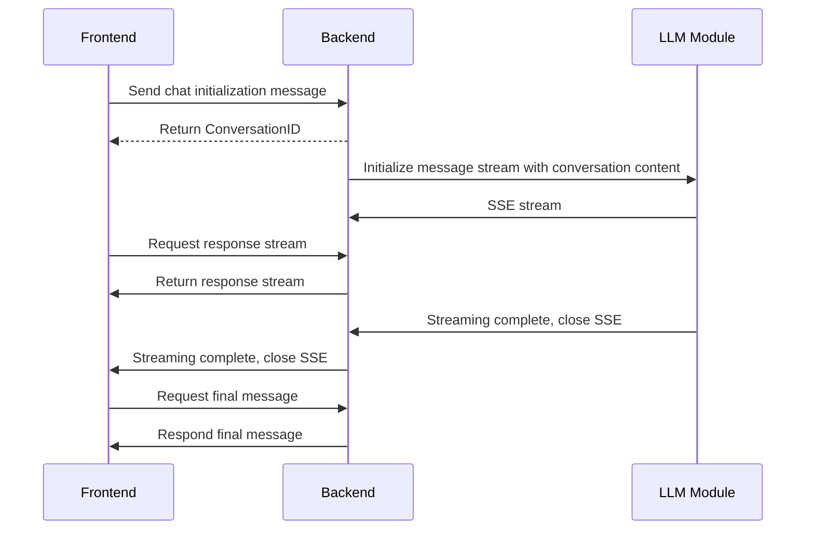
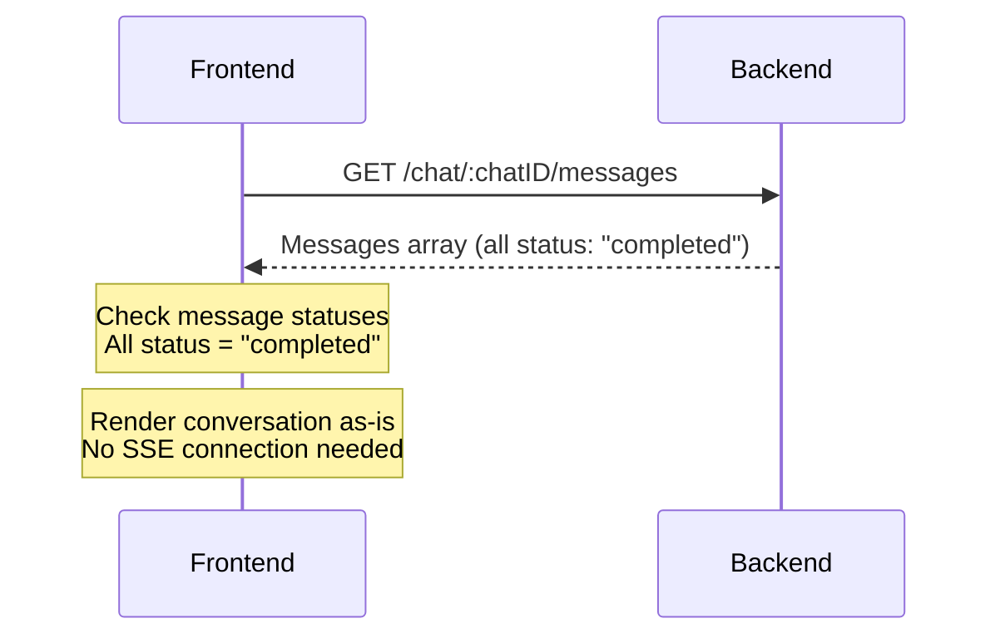
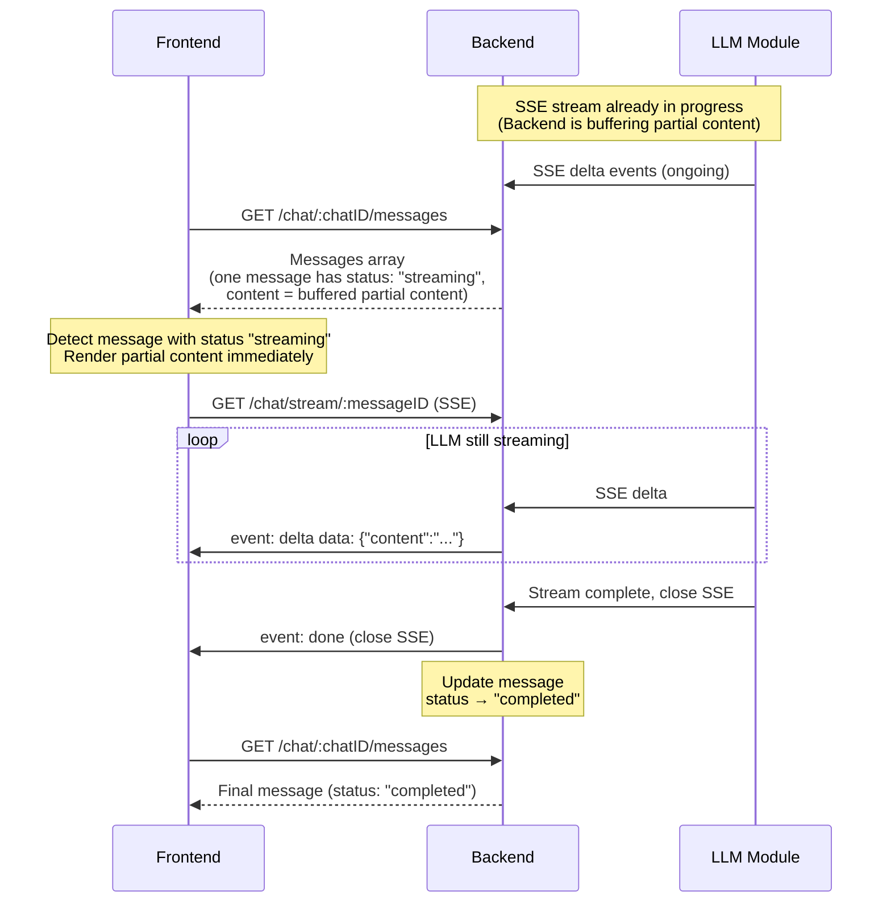
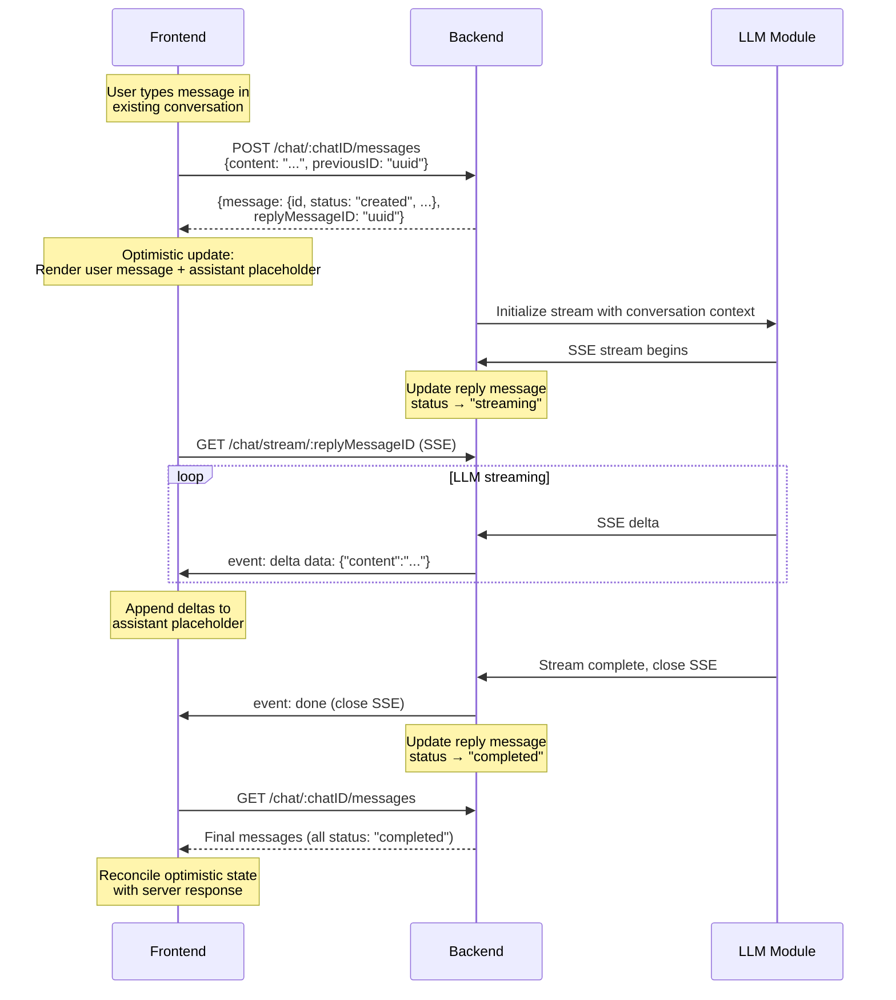
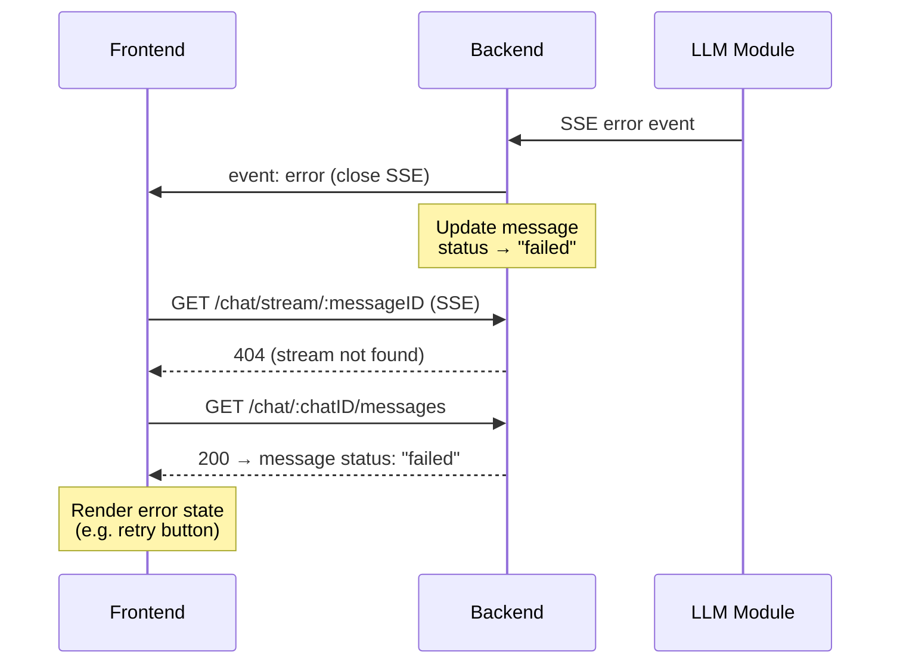

<aside>


最後更新：Sprint 5

</aside>

## 一個 LLM 的使用者旅程

1. Alice 問了 LLM 一個問題
2. LLM 給了 Alice 一個回答
3. Alice 問了 LLM 第二個問題
4. LLM 在回答到一半時，Alice 不小心斷網，重新連線後 LLM 看到 LLM 還在持續回答
5. LLM 的第二個回答 Alice 不滿意，Alice 重新生成了一次回答
6. LLM 的第二次回答 Alice 還是不滿意，因次 Alice 更改了他第二個問題的 Prompt
7. LLM 針對新 prompt 回答得更爛了，Alice 很不爽，決定改回第一個 prompt 的討論串繼續追問

以上的旅程可以讓你發現~~使用者是種很雞掰的生物~~寫一個好用的 LLM App 沒有那麼簡單。因此，這份 technical specification 的核心著重於定義 SciEdu 的 LLM 相關元件的行為。

## LLM 的兩個 Data Model

一次與 LLM 的互動會有兩種物件

- Message：具體的互動，包含角色（是使用者傳的還是 LLM 傳的）與內容（說了什麼）
- Conversation：包含著多個 `Message` 的一份 array，每個 `Message` 都會記錄自己的 `previousMesssageID`

## 一個 Conversation 的流程

### 當使用者想開啟一個新的對話



### 使用者載入了沒有 Message 在串流的 Conversation



### 使用者載入了有 Message 串流到一半的 Conversation



### 使用者在一個既有的對話裡繼續了討論



### LLM Module Error 後端行為



## API 行為

### 當新的 SSE 連線發生

- 如果目前沒有 SSE，回傳由 API Spec 訂定之 4XX code
- 如果有進行到一半的 SSE
    - 先 yield 一個帶有過往已經 stream 完的資料的 chunk
    - 接著當後端收到新的 chunk 時，持續的 stream 新的 chunk 給前端
    - 舉例而言
        
        ```mermaid
        sequenceDiagram
            participant FE as Frontend
            participant BE as Backend
            participant LLM as LLM Module
        
        		LLM->>BE: Starts SSE stream
        		LLM-->>BE: Hello
        		LLM-->>BE: world
        		LLM-->>BE: sample
        		LLM-->>BE: stream
        
            FE->>BE: GET /chat/stream/:streamId
            BE-->>FE: chunk "data": "Hello world sample stream"
            
        		LLM-->>BE: looks
        		BE-->>FE: looks
        ```
